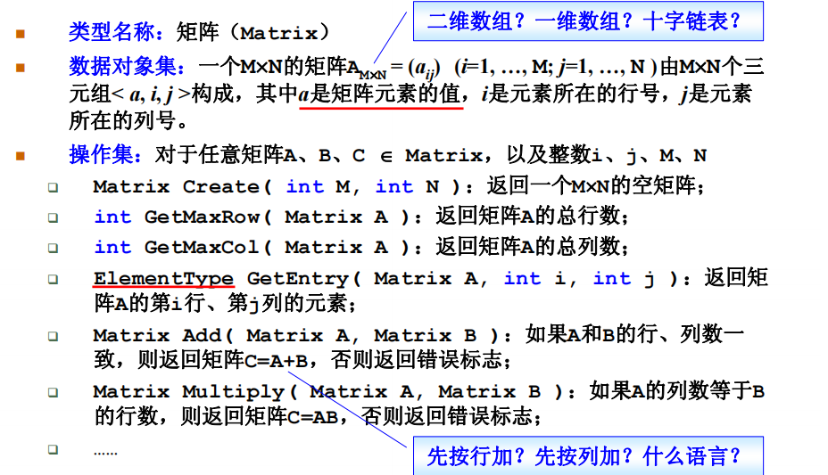

### 一、解决问题时，与哪些因素有关？

#### 1、数据的组织方式

​	现在有一个需求，在书架上摆放图书。

**需要考虑：**

1. 新书怎么插入
2. 如何定位某一本书

**方法：**

1. 随便放：
   	插入：哪里有空放哪里，直接插入到最后，效率很高
      	定位：每次定位都需要遍历所有的书

2. 按照书名的拼音字母顺序排放：

   ​	插入：每次插入一本书，二分定位置，然后需要把后面的书全部向后挪一位。
   ​	定位：二分

3. 把书架划分成几块区域，每块区域指定摆放某种类别的图书；在每种类别内，按照书名的拼音字母顺序排放：

   ​	插入：先定类别，然后二分查找去确定位置，然后该分类的后面数据全部后移
   ​	定位：先定类别，然后二分查找定位
   ​	问题：类别粒度粗细该如何确定。

**结论：**

​	根据上面的需求，可以发现**解决问题方法的效率，跟数据的组织方式有关**。

#### 2、空间的利用效率

​	写程序实现一个函数，使得传入一个正整数为N的参数后，能顺序打印从1到N的全部正整数。

**实现-循环：**

~~~C++
void forFunction(int n)
{
    int i;
    for (i = 1; i <= n; i++)
    {
        cout << i << " ";
    }
}
~~~

**实现-递归：**

~~~C++
void recursion(int n)
{
    if (n)
    {
        recursion(--n);
        cout << n << " ";
    }
    return;
}
~~~

**结论：**

​	当n比较小的时候，二者都可以正常实现功能，当n达到十万，递归则会直接程序异常结束（因为空间占用满了）。

​	所以得出结论**解决问题方法的效率，跟空间的利用效率有关**。

#### 3、算法的巧妙程度有关

​	写程序计算给定多项式，在给定点 x = 1.1 处的值 f(1.1)。

**实现-依次计算每一项：**

~~~C++
double f1( int n, double a[], double x )
{ 
    int i;
	double p = a[0];
	for ( i=1; i<=n; i++ ){
        p += (a[i] * pow(x, i)); 
    }
	return p;
}
~~~

**实现-秦九韶算法**

~~~ C++
double f2( int n, double a[], double x )
{ 
    int i;
	double p = a[n];
	for(i=n; i>0; i--){
        p = a[i-1] + x*p;
    }
	return p;
}
~~~

**结论：**

​	因为这两个方法执行速度都很快，可以重复执行多次求平均值得到时间。

​	可以发现秦九韶算法要比直接计算快一个数量级。

所以得出结论：**解决问题方法的效率，跟算法的巧妙程度有关**。

### 二、什么是数据结构？

​	数据结构就是：**数据对象**在计算机中的组织方式（逻辑结构、物理存储结构）。而数据对象必定与一系列加在其上的**操作**相关联，完成这些操作所用的方法就是**算法**

什么是抽象数据类型（Abstract Data Type）？
**数据类型**：
	数据对象集
	数据集合相关联的操作集
**抽象**：描述数据类型的方法不依赖于具体实现
	与存放数据的机器无关
	与数据存储的物理结构无关
	与实现操作的算法和编程语言均无关
只描述数据对象集和相关操作集“**是什么**”，并不涉及“**如何做到**”的问题

例如：

