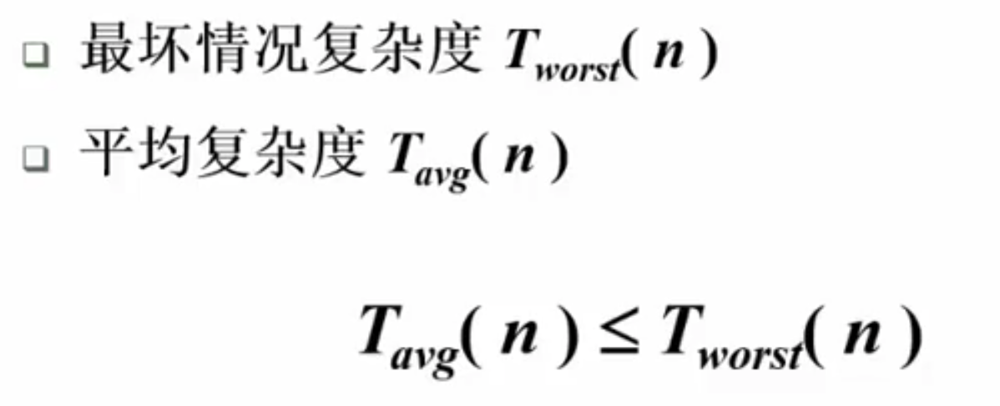
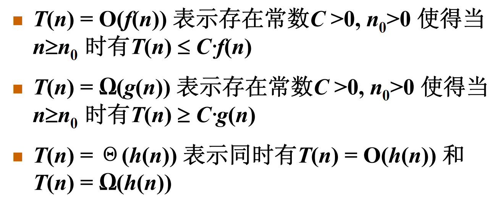
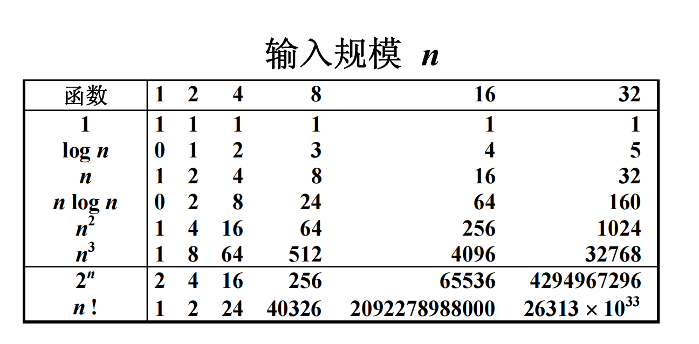
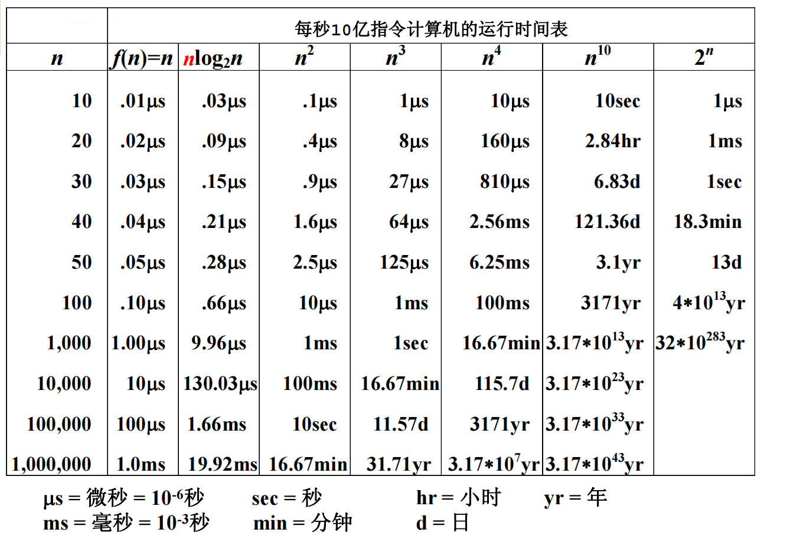
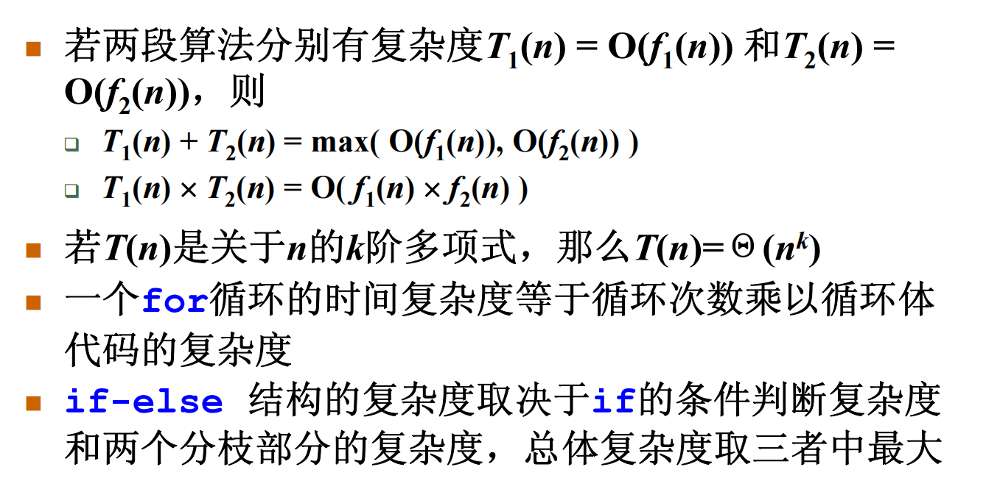

### 一、定义

- 一个有限指令集
- 接受一些输入（有些情况下不需要输入）
- 产生输出
- 一定在有限步骤之后终止
- 每一条指令必须
  - 有充分明确的目标，不可以有歧义
  - 计算机能处理的范围之内
  - 描述应不依赖于任何一种计算机语言以及具体的实现
    手段

### 二、什么是好的算法

#### 1、**空间复杂度S(n) ：**

​	根据算法写成的程序在执行时占用存储单元的长度。这个长度往往与输入数据的规模有关。空间复杂度过高算法可能导致使用的内存超限，造成程序非正常中断。

#### 2、**时间复杂度T(n)：**

​	根据算法写成的程序在执行时耗费时间的长度。这个长度往往也与输入数据的规模有关。时间复杂度过高的效算法可能导致我们在有生之年都等不到运行结果。

#### 3、**在分析一般算法的效率时，我们经常关注两种复杂度：**

​	一般总是分析最坏情况复杂度，因为平均复杂度一般比较难

#### 4、**复杂度的渐进表示法：**

#### 5、一些常见算法复杂度：

#### 6、复杂度分析技巧

