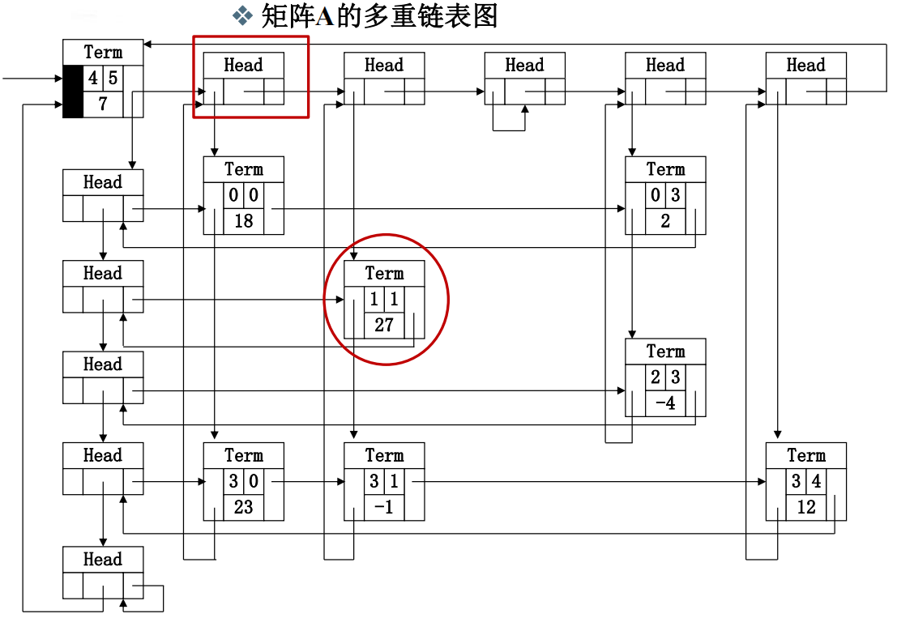

[TOC]

## 一、引入

### 需求：

​	如何使用程序表示一元多项式方程并进行主要运算。

**一元多项式表现：**
$$
f(x) = a_0 + a_1x + ... + a_{n-1}x^{n-1} + a_n^n
$$
**主要运算：**

​	多项式相加、相减、相乘等

**分析：**

​	多项式的关键数据：

- 多项式的项数n
- 各项的系数 $a_i $ 以及指数i

### 方式一：顺序存储结构直接表示

​	使用数组的下标表示指数 i

​	使用数组对应下标的值表示 指数为 i 的系数 $a_i$

**例如：**
$$
f(x) = 1 - 3x^2 + 4x^5
$$
表示为：

​	

**相加操作：**

​	直接数组对应下标的值相加即可，因为下标相同则指数相同，直接系数相加即可。

**问题：**

​	表示 $x+3x^2000$ 这个多项式，就需要使用一个长度为2001的数组，且仅有两个位置的值不为0，极大的浪费空间。

### 方式二：顺序存储结构仅存储非零项

​	每个非零项 $a_ix^i$ 涉及两个信息：系数 $a_i$ 和指数 $i$ ，可以将一个多项式看成是一个 ( $a_i$，$i$ ) 二元组的集合。

​	即数组的每一项实际上是一个二元组，分表表示多项式的系数和指数。

​	注意，需要按照指数的大小按顺序存储，下面例子按照指数的降序排序。

**例如：**
$$
P_1(x) = 9x^{12} + 15x^{8} + 3x^2  和  P_2(x) = 26x^{19} - 4x^{8} - 13x^6 + 82
$$
表示为：


**相加操作：**

​	两个多项式都从第一个元素开始，比较指数。（类似于合并有序数组）

​		指数不相等时：

​			较大的那个作为结果的第一项；

​			较小的那个继续与较大的那个数组的第二个元素比较。

​		指数相等时直接系数想加减作为结果。

**例如：**

​	还是上述的例子，P3表示相加后的结果。


### 方式三：链表结构存储非零项

​	链表中，每个**结点**存储一个多项式的**非零项**，包括该非零项的**系数和指数**两个数据以及一个**指针域**。

例如 $9x^2$ 就表示为：

| 系数`coef` | 指数`expon` | 指针`link`       |
| ---------- | ----------- | ---------------- |
| 9          | 2           | 指向下一项的结点 |

~~~java
class Node{
    int coef;
    int expon;
    Node nextNode = null;
}
~~~

**例如：**
$$
P_1(x) = 9x^{12} + 15x^8 + 3x^2 \\
P_2(x) = 26x^{19} - 4x^8 - 13x^6 + 82
$$
表示为：


相加操作与方式二类似。

## 二、定义

**由上述引入中的三种方式可知：**

1. 同一个问题可以有不同的表示（存储）方法
 2. 有一类共性问题：有序线性序列的组织和管理

**线性表定义为：**

​	**线性表(Linear List)**：由**同类型数据元素**构成**有序序列**的线性结构。

- 表中元素个数称为线性表的**长度**
- 线性表没有元素时，称为**空表**
- 表起始位置称**表头**，表结束位置称**表尾**

**线性表的抽象描述：**

- 类型名称：线性表（List）
- 数据对象集：线性表是 n (≥0)个元素构成的有序序列($a_1,a_2,...a_n$)
- 操作集：线性表 $L\in  List$，整数 $i$ 表示位置，元素$X \in ElementType$，

**线性表基本操作主要有：**

1. `List makeEmpty()`：初始化一个空线性表L，这里直接使用构造方法初始化一个线性表;
2. `T get(int index);`：根据下标index，返回相应位置的元素;
3. `int indexOf(Object o);`：在线性表L中查找元素O的第一次出现位置；
4. `void add(int index,T value);`：在位序index位置插入一个新元素；
5. `void delete(int index);`：删除指定位序index的元素；
6. `int size();`返回线性表中元素的个数。

~~~ java
public interface MyList<T> {
    /**
     * 获取一个元素在线性表中第一次出现的位置
     * @param o 待比较元素
     * @return 返回该元素在线性表中第一次出现的位置，无则返回-1
     */
    int indexOf(Object o);

    /**
     * 获取线性表第index位置的元素
     * @param index 线性表第几号元素
     * @return 线性表第index号元素的值
     */
    T get(int index);

    /**
     * 在第index元素位置插入一个新的元素value，剩余元素后移
     * @param index 待插入位置
     * @param value 插入元素的值
     */
    void add(int index,T value);

    /**
     * 插入一个元素，默认放在顺序表最后的位置
     * @param value 待插入的值
     */
    void add(T value);

    /**
     * 删除index号元素
     * @param index 待删除元素的位置
     */
    void delete(int index);

    /**
     * 获取当前线性表的元素个数
     * @return 线性表内元素个数
     */
    int size();
}

~~~


## 三、线性表的顺序实现

​	利用数组的**连续存储空间**顺序存放线性表的各元素。

​	数组存储数据，last表示最后一个元素的下标。

​	泛型T表示存储的数据类型。

~~~ java
public class SequentialList<T> {
    // 顺序表的最大存储数量
    private static final int MAXSIZE = 100;
    // 数据存储数组
    private Object[] data = new Object[MAXSIZE];
    // 当前最后一个元素的坐标
    private int last;
}
~~~


### 主要操作实现：

#### 1、初始化

​	初始化一个空的线性表，其中last为 -1表示当前为线性表为空。

~~~ java
    public SequentialList() {
        this.last = -1;
    }
~~~

#### 2、查找-查找对应下标的元素值

**时间复杂度分析：**

​	时间复杂度为$O(1)$

~~~java
	@Override
    @SuppressWarnings("unchecked")
    public T get(int index) {
        if (index > last || index < 0) {
            System.out.println("index参数不合法");
            return null;
        }
        return (T) data[index];
    }
~~~

#### 3、查找-查找元素第一次出现的下标

​	查找数组是否含有某个元素，并返回其下标，若没有则返回-1.

**时间复杂度分析：**

​	查找成功的平均比较次数为$[1+2+...+n]/n=(1+n)/2$，平均时间性能为$O(n)$。

~~~java
	@Override
    public int indexOf(Object o) {
        if (size == -1) {
            System.out.println("顺序表为空");
            return -1;
        }
        if (o == null) { // 元素为空则寻找顺序表中是否有空元素
            for (int i = 0; i < size; i++) {
                if (data[i] == null) {
                    return i;
                }
            }
        } else { // 元素不为空则通过equals()方法判断两个元素是否相同。
            for (int i = 0; i < size; i++) {
                if (o.equals(data[i])) {
                    return i;
                }
            }
        }
        // 找不到返回-1
        return -1;
    }
~~~

#### 4、插入

1、插入到某个坐标

**时间复杂度分析：**

​	插入成功的平均移动次数为$[0+1+...+n]/n=(n)/2$，平均时间性能为$O(n)$。

~~~ java
    @Override
    public void add(int index, T value) {
        // 待插入位置index小于0、大于last时说明参数不合法，last+1 等于MAXSIZE时说明顺序表已满
        if (index < 0 || (index > last && last >= 0) || ++this.last == MAXSIZE) {
            System.out.println("index不合法或顺序表已满");
            return;
        }
        // 从后往前依次赋值
        for (int i = last; i > index; i--) {
            data[i] = data[i - 1];
        }
        data[index] = value;
    }
~~~

2、直接插入到最后

~~~java
    @Override
    public void add(T value) {
        // last+1等于MAXSIZE说明顺序表已经满了
        if (++this.last == MAXSIZE) {
            System.out.println("顺序表已满");
            return;
        }
        data[last] = value;
    }
~~~

#### 5、删除

**时间复杂度分析：**

​	插入成功的平均移动次数为$[0+1+2+...+n-1]/n=(n-1)/2$，平均时间性能为$O(n)$。

~~~java
    @Override
    public void delete(int index) {
        // index小于0、index大于last说明参数不合法，last减一后小于0说明顺序表为空，不能删除
        if (index < 0 || index > this.last || --last < 0) {
            System.out.println("index参数错误或顺序表为空");
            return;
        }
        for (int i = index; i <= last; i++) {
            data[i] = data[i + 1];
        }
    }
~~~

#### 6、元素个数

**时间复杂度：**

​	可见，时间复杂度为$O(1)$

~~~java
   @Override
    public int size() {
        return last + 1;
    }
~~~

## 四、线性表的链式存储实现

​	这里不要求线性表逻辑上连续的物理存储结构也连续。

​	通过链来建立存储结构。

```java
public class LinkedList<T> implements MyList<T> {
  	// 当前线性表的第一个元素 
    Node firstNode = null;
  	// 内部类，表示线性表的每一个结点。
    static class Node {
        Object data;
        Node next = null;
    }
}
```

如下图，每个结点都有两个值，一个存储数据，另一个存储下一个结点的值。


### 主要操作实现：

#### 1、初始化

```java
    LinkedList() {
    }
```

**插入、删除、查找等操作均要用到这个方法：**

~~~ java
		/**
     * 获取index下标的元素结点Node
     *
     * @param index 待获取位置下标
     * @return 该下标的值Node，没有该下标的值时返回null。
     */
    private Node getNode(int index) {
        if (index < 0) return null;
        int i = 0;
        Node temNode = firstNode;
        do {
            if (i == index) return temNode;
            ++i;
            temNode = temNode.next;
        }
        while (temNode.next != null);
        if (i == index) return temNode;
        return null;
    }
~~~

#### 2、查找-查找对应下标的元素值

**时间复杂度分析：**

​	每次查找都会比较一次并且判断是否下一个结点是否为空，将这个操作作为基本操作。

​	查找成功的平均基本操作次数为 $n$，平均时间性能为$O(n)$。

```java
		public T get(int index) {
        Node temNode = getNode(index);
        if (temNode == null) {
            return null;
        } else {
            return (T) temNode.data;
        }
    }
```

#### 3、查找-查找元素第一次出现的下标

**时间复杂度分析：**

​	每次查找都会比较一次并且判断是否下一个结点是否为空，将这个操作作为基本操作。

​	查找成功的平均基本操作次数为 $n$，平均时间性能为$O(n)$。

```java
		public int indexOf(Object o) {
        if (firstNode == null) return -1;
        Node tempNode = firstNode;
        int index = -1;
        do {
            if (o.equals(tempNode.data)) {
                return ++index;
            }
            ++index;
            tempNode = tempNode.next;
        } while (tempNode.next != null);
        return -1;
    }
```

#### 4、插入

1、插入到某个坐标

**时间复杂度分析：**

​	插入成功的平均查找次数为$[0+1+...+n]/n=(n)/2$，不需要移动，平均时间性能为$O(n)$。

```java
		public void add(int index, T value) {
      	// 创建新的结点
        Node dataNode = new Node();
        dataNode.data = value;
      	// 插入位置为第一个结点
        if (index == 0) {
            dataNode.next = firstNode;
            firstNode = dataNode;
            return;
        }
      	// 获取待插入结点的上一个结点
        Node temNode = getNode(index - 1);
        if (temNode != null) { // 插入
            dataNode.next = temNode.next;
            temNode.next = dataNode;
        } else {
            System.out.println("index参数错误");
        }
    }
```

2、直接插入到最后

​	这里每次都需要从第一个结点遍历到最后，时间复杂的为 $O(n) $

​	如果同时存储最后一个结点的坐标，时间复杂度可以降为 $O(1) $

```java
		public void add(T value) {
        if (firstNode == null) {
            firstNode = new Node();
            firstNode.data = value;
        } else {
            Node temNode = firstNode;
            while (temNode.next != null) temNode = temNode.next;
            temNode.next = new Node();
            temNode.next.data = value;
        }
    }
```

#### 5、删除

**时间复杂度分析：**

​	删除时，评价查找次数为$[0+1+...+n]/n=(n)/2$，不需要移动其他元素，平均时间性能为$O(n)$。

```java
		public void delete(int index) {
        if (index < 0) return;
        if (index == 0) firstNode = firstNode.next;
        Node temNode = getNode(index - 1);
        if (temNode == null || temNode.next == null) {
            return;
        }
        temNode.next = temNode.next.next;
    }
```

#### 6、元素个数

**时间复杂度：**

​	当前获取元素个数时，每次都需要从第一个结点遍历到最后，时间复杂的为 $O(n) $

​	如果同时存储一个当前元素个数并进行维护，时间复杂度可以降为 $O(1) $

```java
    public int size() {
        if (firstNode == null) return 0;
        int count = 1;
        Node temNode = firstNode;
        while (temNode.next != null) {
            ++count;
            temNode = temNode.next;
        }
        return count;
    }
```

## 五、广义表

​	广义表是**线性表的推广**。

​	对于线性表而言，如果有n个元素，那么这n个元素都是**单元素**。

​	对于广义表而言，每个元素都可以是单元素，也可以是另一个**广义表**。

**广义表和线性表关系：**

- 每个线性表都可以看作是广义表，但广义表不一定是线性表。广义表可以包含原子元素（类似于线性表的数据元素），也可以包含其他广义表。

- 线性表是广义表的一种特殊情况，当广义表中只包含原子元素时，它就退化成为线性表。

  

### 广义表一般就通过链表实现，下面给出一般实现：

广义表的每个元素结点实际上如下：

​		tag表示数据区域的值时data（单元素）还是Sublist（另一个广义表）

​		

~~~ java
public class GeneralizedList<T> {
    // 广义表内只存储第一个结点
    GNode<T> head;

    static class GNode<T> {
        int tag;  // 标志域：0表示结点是单元素，1表示结点是广义表

        GNode<T> next;    // 指向后继结点

        // 数据区域要么为另一个广义表，要么为具体数据
        T data;   // 单元素数据域
        GeneralizedList<T> subList; // 指向子表的引用

        public GNode(int tag, T data) {
            this.tag = tag;
            // 如果 tag = 0 说明数据区域为 具体数据，直接赋值，否则为另一个广义表
            if (tag == 0) {
                this.data = data;
            } else {
                this.subList = new GeneralizedList<>();
            }
            this.next = null;
        }
    }

    public GeneralizedList(){
        this.head = null;
    }
    
    // 插入、查找、删除等方法实现。
}
~~~

## 六、多重链表

​	多重链表就是**链表的变体**。

​	多重链表中的结点**可能同时属于多个链**。

​	多重链表中结点的**指针域会有多个**，比如上述广义表的一般实现中的结点就包含了next和sublist两个指针域。

例子：

​	如下图，矩阵可以使用二维数组去表示，但是有两个问题：

- 数组的**大小需要事先确定好**。
- 对于**“稀疏矩阵”**，将会造成**大量的存储空间浪费**。

$$
A=\left[
     \begin{matrix}
       18 & 0  & 0 & 2  & 0 \\
       0  & 27 & 0 & 0  & 0 \\
       0  & 0  & 0 & -4 & 0 \\
       23 & -1 & 0 & 0  & 12
      \end{matrix}
  \right]
  B=\left[
        \begin{matrix}
           0 & 2  & 11 & 0 & 0  & 0\\
           3 & -4 & -1 & 0 & 0  & 0\\
           0 & 0  & 0  & 9 & 13 & 0\\
           0 & -2 & 0  & 0 & 10 & 7\\
           6 & -2 & 0  & 5 & 0  & 0
        \end{matrix}
  	\right]
$$


**分析：**

​	采用一种典型的多重链表—**十字链表**来存储稀疏矩阵

- 只存储矩阵非0元素项
  结点的**数据域**：行坐标Row、列坐标Col、数值Value
- 每个结点通过**两个指针域**，把同行、同列串起来;
  - 行指针(或称为向右指针)Right
  - 列指针（或称为向下指针）Down

**具体实现：**

​	用一个标识域Tag来区分头结点和非0元素结点：

​		头节点的标识值为“Head”

​		矩阵非0元素结点的标识值为“Term”。


如下图（对应上述矩阵A）：

​	可以看到有两种结点：

​		tag为Head的头结点

​		tag为Term的非0元素结点。

​	左上角的Term结点为整个矩阵的入口结点：

​		４，５表示矩阵为４行５列。

​		７表示矩阵一共有７个非零元素。

​	可见每个非零元素结点都同时属于两个链表：

​		一个行链表。

​		一个列链表。




